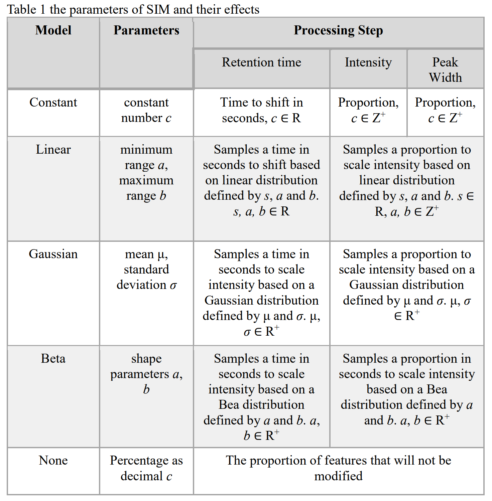
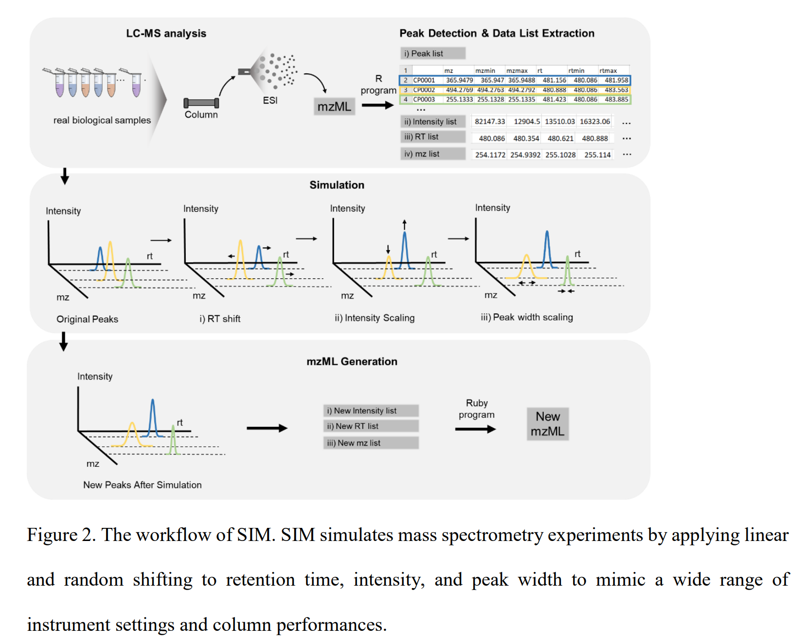

# Setup Instructions

## I. Setting up language & system variables

1. Download Ruby version 2.3.3 from [Ruby Installer](https://rubyinstaller.org/downloads/archives/).
2. Download `cacert.pem` from [curl documentation](https://curl.se/docs/caextract.html).
3. Open Control Panel and search for 'System Environment Variables'.
4. In the window that appears, click the 'Environment Variables' button at the bottom right.
5. Under 'Environment Variables', click 'New' and add the path to cacert.perm under SSL_CERT_FILE
6. Select ok for all

## Workflow

The workflow and parameters of SIM is described as the following

